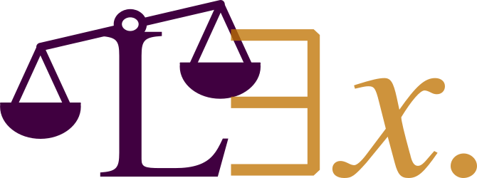

Lex — A Language for Compliance by Design
=========================================

---
To bridge the gap between digital regulations like GDPR and actual software implementation, we introduce Lex, a formal language for Compliance by Design. Lex allows lawyers and developers to jointly formalize legal requirements into enforceable temporal logic policies. Our toolkit—featuring a compiler, runtime enforcement, and a Python instrumentation library—ensures applications remain compliant with minimal overhead. User studies and real-world testing on Python web apps confirm Lex is the first rigorous, end-to-end framework for mechanized regulatory compliance.

# Documentation Overview
This documentation contains: 

- [Installation instructions](installation/installation.md)
- Several [tutorials](tutorials/gdpr.md) that show example implementations and show the general concepts of Lex.
- [Syntax reference](syntax/0_Overview.md) and a [syntax cheatsheet](syntax/cheatsheet.pdf).
- Example applications of Lex, like [Enforcment](enforcement.md) and [Lexbots](lexbots.md). 